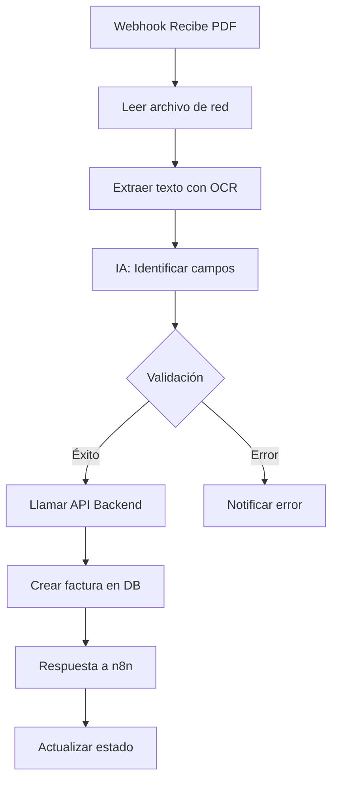
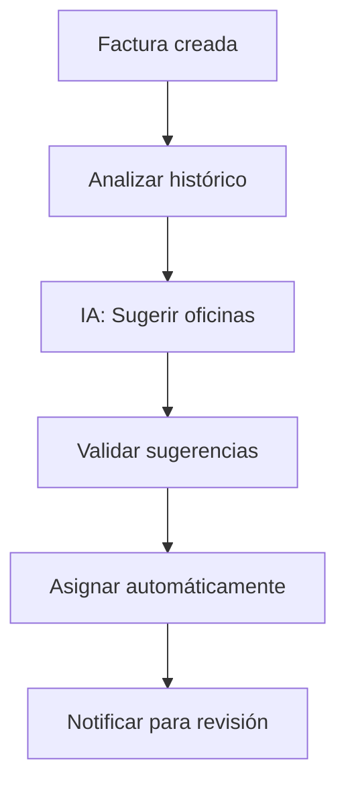

# Automatización con n8n

## 📋 Descripción General

n8n es la plataforma de automatización que orquesta el flujo de procesamiento inteligente de facturas, desde la recepción del PDF hasta la extracción de datos con IA y su registro en el sistema.

## 🔗 Configuración de Webhooks

### Webhook Principal - Procesamiento de Facturas

**URL:** `https://saman.lafortuna.com.co/n8n/webhook/d15fc127-671d-4b24-8221-bac74a6f4648`

**Método:** POST

**Trigger:** Cuando se sube una factura PDF manualmente

**Payload enviado por el backend:**
```json
{
  "event": "invoice_uploaded",
  "file_path": "\\\\192.168.2.20\\Facturas\\temp\\20260120_abc123_factura.pdf",
  "file_url": "file://192.168.2.20/Facturas/temp/20260120_abc123_factura.pdf",
  "filename": "20260120_abc123_factura.pdf",
  "original_filename": "factura.pdf",
  "uploaded_at": "2026-01-20T16:30:00"
}
```

## 🔄 Flujos de Trabajo (Workflows)

### Flujo 1: Procesamiento de Factura PDF



**Pasos detallados:**

1. **Recepción del Webhook**
   - Trigger: HTTP Request POST
   - Valida que el archivo exista
   - Extrae metadata del payload

2. **Lectura del PDF**
   - Accede a la ruta de red compartida
   - Lee el contenido del archivo
   - Convierte a formato procesable

3. **Extracción con OCR/IA**
   - Utiliza servicio de OCR (ej: Tesseract, Google Vision)
   - Extrae texto completo del documento
   - Identifica estructura del documento

4. **Procesamiento Inteligente**
   - **IA identifica campos clave:**
     - NIT del proveedor
     - Nombre del proveedor
     - Número de factura
     - Fecha de factura
     - Fecha de vencimiento
     - Valor total
     - CUFE (si es factura electrónica)
   - Valida formato de datos
   - Normaliza información

5. **Validación de Datos**
   - Verifica que campos obligatorios estén presentes
   - Valida formato de fechas (YYYY-MM-DD)
   - Valida formato de NIT
   - Verifica que el valor sea numérico

6. **Llamada al Backend**
   - **Endpoint:** `POST /api/facturas/crear-con-oficina`
   - **Headers:** `X-API-Key: {api_key}`
   - **Body:**
   ```json
   {
     "proveedor_nit": "890123456",
     "proveedor_nombre": "CLARO COLOMBIA S.A.",
     "numero_factura": "FAC-2026-001",
     "fecha_factura": "2026-01-15",
     "fecha_vencimiento": "2026-02-15",
     "valor": 1500000.00,
     "cufe": "abc123def456...",
     "url_factura": "file://192.168.2.20/Facturas/temp/20260120_abc123_factura.pdf",
     "observaciones": "Procesada automáticamente por IA"
   }
   ```

7. **Procesamiento de Respuesta**
   - **Si éxito (success: true):**
     - Registra factura_id
     - Actualiza estado a "COMPLETED"
     - Envía notificación de éxito
   
   - **Si error (success: false):**
     - Registra error_message
     - Actualiza estado a "ERROR"
     - Envía notificación de error con detalles

8. **Notificaciones**
   - Email al equipo contable
   - Mensaje en Slack/Teams (opcional)
   - Log en sistema de monitoreo

### Flujo 2: Asignación Automática de Oficinas (Futuro)

**Estado:** Planificado

**Propósito:** Detectar automáticamente qué oficinas deben asignarse basándose en:
- Histórico de facturas del proveedor
- Patrones de consumo
- Reglas de negocio configurables



### Flujo 3: Recordatorios de Facturas Pendientes

**Estado:** Planificado

**Trigger:** Cron diario

**Propósito:** Notificar sobre:
- Facturas próximas a vencer
- Facturas sin asignar oficina
- Contratos sin factura del mes

## 🤖 Integración con IA

### Modelos Utilizados

#### OCR (Optical Character Recognition)
- **Opciones:**
  - Google Cloud Vision API
  - AWS Textract
  - Tesseract (open source)
  - Azure Computer Vision

#### Extracción de Entidades (NER)
- **Propósito:** Identificar campos específicos en el texto
- **Campos objetivo:**
  - NIT: Patrón numérico de 9-10 dígitos
  - Número de factura: Alfanumérico
  - Fechas: Formato DD/MM/YYYY o YYYY-MM-DD
  - Valores monetarios: Números con separadores
  - CUFE: Código alfanumérico largo

#### Validación y Corrección
- **IA valida:**
  - Coherencia de datos
  - Formato de campos
  - Suma de valores vs total
- **IA corrige:**
  - Errores de OCR comunes
  - Formato de fechas
  - Separadores de miles

### Ejemplo de Prompt para IA

```
Analiza el siguiente texto extraído de una factura colombiana y extrae la siguiente información en formato JSON:

{
  "proveedor_nit": "NIT del proveedor (solo números)",
  "proveedor_nombre": "Nombre completo del proveedor",
  "numero_factura": "Número de la factura",
  "fecha_factura": "Fecha de emisión (formato YYYY-MM-DD)",
  "fecha_vencimiento": "Fecha de vencimiento (formato YYYY-MM-DD)",
  "valor": "Valor total (solo número, sin símbolos)",
  "cufe": "Código CUFE si existe"
}

Texto de la factura:
{texto_ocr}

Reglas:
- Si no encuentras un campo, usa null
- Las fechas deben estar en formato YYYY-MM-DD
- El valor debe ser numérico sin símbolos de moneda
- El NIT debe ser solo números sin puntos ni guiones
```

## 📊 Monitoreo y Logs

### Métricas Importantes

| Métrica | Descripción | Objetivo |
|---------|-------------|----------|
| Tasa de éxito | % de facturas procesadas correctamente | > 95% |
| Tiempo de procesamiento | Tiempo desde upload hasta creación en DB | < 30 seg |
| Precisión de extracción | % de campos extraídos correctamente | > 90% |
| Errores de validación | Facturas rechazadas por datos inválidos | < 5% |

### Estados de Procesamiento

```python
class ProcessingStatus:
    UPLOADING = "UPLOADING"      # Archivo siendo subido
    PROCESSING = "PROCESSING"    # n8n procesando
    COMPLETED = "COMPLETED"      # Éxito
    ERROR = "ERROR"              # Error en procesamiento
```

### Logs en n8n

**Información registrada:**
- Timestamp de cada paso
- Datos extraídos en cada etapa
- Errores y excepciones
- Tiempo de ejecución
- Respuestas de APIs

## 🔧 Configuración de n8n

### Variables de Entorno en n8n

```env
BACKEND_API_URL=https://saman.lafortuna.com.co/api
BACKEND_API_KEY=***
OCR_API_KEY=***
NOTIFICATION_EMAIL=contabilidad@lafortuna.com.co
```

### Nodos Comunes Utilizados

1. **Webhook** - Recepción de eventos
2. **HTTP Request** - Llamadas a APIs
3. **Code** - Procesamiento personalizado en JavaScript
4. **IF** - Lógica condicional
5. **Set** - Transformación de datos
6. **Email** - Notificaciones
7. **Error Trigger** - Manejo de errores

### Ejemplo de Nodo Code (JavaScript)

```javascript
// Extraer y validar datos de factura
const ocrText = $input.first().json.text;

// Función para extraer NIT
function extractNIT(text) {
  const nitPattern = /NIT[:\s]*(\d{9,10})/i;
  const match = text.match(nitPattern);
  return match ? match[1] : null;
}

// Función para extraer fecha
function extractDate(text, label) {
  const pattern = new RegExp(label + '[:\\s]*(\\d{2}/\\d{2}/\\d{4})', 'i');
  const match = text.match(pattern);
  if (match) {
    const [day, month, year] = match[1].split('/');
    return `${year}-${month}-${day}`;
  }
  return null;
}

// Extraer datos
const data = {
  proveedor_nit: extractNIT(ocrText),
  numero_factura: extractInvoiceNumber(ocrText),
  fecha_factura: extractDate(ocrText, 'Fecha'),
  valor: extractAmount(ocrText)
};

// Validar
if (!data.proveedor_nit || !data.numero_factura) {
  throw new Error('Datos obligatorios no encontrados');
}

return { json: data };
```

## 🔐 Seguridad

### Autenticación
- **Webhooks:** URLs únicas y secretas
- **API Backend:** Requiere X-API-Key
- **OCR Services:** API Keys específicas

### Datos Sensibles
- Credenciales en variables de entorno
- No se almacenan PDFs en n8n
- Logs sanitizados (sin datos sensibles)

## ⚠️ Manejo de Errores

### Estrategias de Retry

```javascript
// Configuración de reintentos
{
  "retry": {
    "maxAttempts": 3,
    "waitBetween": 5000,  // 5 segundos
    "backoff": true
  }
}
```

### Errores Comunes y Soluciones

| Error | Causa | Solución |
|-------|-------|----------|
| OCR failed | PDF ilegible o corrupto | Notificar para procesamiento manual |
| NIT not found | Proveedor no existe | Crear proveedor con nombre extraído |
| Invalid date format | Formato de fecha no reconocido | Intentar múltiples patrones |
| API timeout | Backend no responde | Reintentar con backoff |
| Network path not found | Archivo no accesible | Verificar permisos de red |

### Notificaciones de Error

**Email de error incluye:**
- Nombre del archivo
- Timestamp del error
- Mensaje de error detallado
- Datos parciales extraídos
- Link al workflow en n8n
- Sugerencias de acción

## 📈 Optimizaciones

### Performance
- **Cache de proveedores:** Evitar consultas repetidas
- **Procesamiento paralelo:** Múltiples facturas simultáneas
- **Queue management:** Cola de procesamiento

### Precisión
- **Entrenamiento del modelo:** Mejorar con feedback
- **Templates por proveedor:** Patrones específicos
- **Validación cruzada:** Verificar coherencia de datos

## 🔄 Actualizaciones y Mantenimiento

### Versionado de Workflows
- Workflows versionados en n8n
- Backup antes de cambios
- Testing en ambiente de desarrollo

### Monitoreo Continuo
- Dashboard de n8n con métricas
- Alertas automáticas por errores
- Revisión semanal de logs

---

**Próximo:** [Extracción de Datos con IA](../04_Extraccion_IA/README.md)
