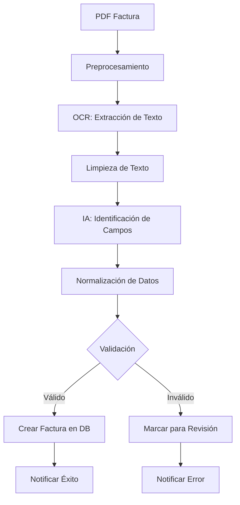

# Extracción de Datos con IA

## 📋 Descripción General

El sistema utiliza Inteligencia Artificial y OCR (Optical Character Recognition) para extraer automáticamente información estructurada de facturas en formato PDF, eliminando la necesidad de entrada manual de datos.

## 🎯 Objetivos de la Extracción

1. **Automatización:** Reducir tiempo de procesamiento de facturas
2. **Precisión:** Minimizar errores de transcripción manual
3. **Escalabilidad:** Procesar múltiples facturas simultáneamente
4. **Validación:** Verificar coherencia de datos extraídos

## 🔍 Campos Extraídos

### Campos Obligatorios

| Campo | Descripción | Formato | Ejemplo |
|-------|-------------|---------|---------|
| **NIT Proveedor** | Identificación del proveedor | Numérico 9-10 dígitos | 890123456 |
| **Número Factura** | Número único de la factura | Alfanumérico | FAC-2026-001 |
| **Fecha Factura** | Fecha de emisión | YYYY-MM-DD | 2026-01-15 |
| **Valor Total** | Monto total de la factura | Decimal | 1500000.00 |

### Campos Opcionales

| Campo | Descripción | Formato | Ejemplo |
|-------|-------------|---------|---------|
| **Nombre Proveedor** | Razón social del proveedor | Texto | CLARO COLOMBIA S.A. |
| **Fecha Vencimiento** | Fecha límite de pago | YYYY-MM-DD | 2026-02-15 |
| **CUFE** | Código único factura electrónica | Alfanumérico largo | abc123def456... |
| **Subtotal** | Valor antes de impuestos | Decimal | 1260504.20 |
| **IVA** | Valor del IVA | Decimal | 239495.80 |

## 🤖 Tecnologías de IA Utilizadas

### 1. OCR (Optical Character Recognition)

**Opciones de implementación:**

#### Google Cloud Vision API
- **Ventajas:**
  - Alta precisión (>95%)
  - Maneja múltiples idiomas
  - Detecta estructura del documento
- **Desventajas:**
  - Costo por uso
  - Requiere conexión a internet

#### AWS Textract
- **Ventajas:**
  - Extrae tablas y formularios
  - Detecta pares clave-valor
  - Integración con AWS
- **Desventajas:**
  - Costo por página
  - Curva de aprendizaje

#### Tesseract (Open Source)
- **Ventajas:**
  - Gratuito
  - Funciona offline
  - Personalizable
- **Desventajas:**
  - Menor precisión
  - Requiere preprocesamiento

### 2. NER (Named Entity Recognition)

**Propósito:** Identificar y clasificar entidades específicas en el texto

**Entidades detectadas:**
- **ORGANIZATION:** Nombre del proveedor
- **DATE:** Fechas de factura y vencimiento
- **MONEY:** Valores monetarios
- **ID:** NIT, CUFE, número de factura

**Modelos utilizados:**
- spaCy con modelo español
- BERT fine-tuned para facturas
- Modelos personalizados entrenados

### 3. LLM (Large Language Models)

**Modelos recomendados:**
- GPT-4 / GPT-3.5
- Claude
- Gemini Pro

**Uso:**
- Extracción estructurada de datos
- Validación de coherencia
- Corrección de errores de OCR

## 📊 Flujo de Procesamiento



### Paso 1: Preprocesamiento del PDF

**Objetivo:** Mejorar calidad de imagen para OCR

```python
from PIL import Image
import pdf2image

def preprocess_pdf(pdf_path):
    # Convertir PDF a imágenes
    images = pdf2image.convert_from_path(pdf_path, dpi=300)
    
    processed_images = []
    for img in images:
        # Convertir a escala de grises
        img = img.convert('L')
        
        # Aumentar contraste
        img = ImageEnhance.Contrast(img).enhance(2.0)
        
        # Reducir ruido
        img = img.filter(ImageFilter.MedianFilter())
        
        processed_images.append(img)
    
    return processed_images
```

### Paso 2: Extracción de Texto con OCR

**Ejemplo con Google Vision:**

```python
from google.cloud import vision

def extract_text_vision(image_path):
    client = vision.ImageAnnotatorClient()
    
    with open(image_path, 'rb') as image_file:
        content = image_file.read()
    
    image = vision.Image(content=content)
    response = client.text_detection(image=image)
    
    if response.error.message:
        raise Exception(response.error.message)
    
    return response.full_text_annotation.text
```

**Ejemplo con Tesseract:**

```python
import pytesseract

def extract_text_tesseract(image_path):
    # Configuración para español
    custom_config = r'--oem 3 --psm 6 -l spa'
    
    text = pytesseract.image_to_string(
        image_path,
        config=custom_config
    )
    
    return text
```

### Paso 3: Extracción Inteligente de Campos

**Usando LLM (GPT-4):**

```python
import openai

def extract_invoice_data(ocr_text):
    prompt = f"""
Analiza el siguiente texto de una factura colombiana y extrae la información en formato JSON.

Campos requeridos:
- proveedor_nit: NIT del proveedor (solo números, sin puntos ni guiones)
- proveedor_nombre: Nombre completo del proveedor
- numero_factura: Número de la factura
- fecha_factura: Fecha de emisión (formato YYYY-MM-DD)
- fecha_vencimiento: Fecha de vencimiento (formato YYYY-MM-DD)
- valor: Valor total (número decimal, sin símbolos)
- cufe: Código CUFE si existe (null si no)

Reglas:
1. Si no encuentras un campo, usa null
2. Convierte fechas a formato YYYY-MM-DD
3. El valor debe ser numérico sin símbolos de moneda ni separadores
4. El NIT debe ser solo números

Texto de la factura:
{ocr_text}

Responde SOLO con el JSON, sin texto adicional.
"""

    response = openai.ChatCompletion.create(
        model="gpt-4",
        messages=[
            {"role": "system", "content": "Eres un experto en extracción de datos de facturas colombianas."},
            {"role": "user", "content": prompt}
        ],
        temperature=0.1
    )
    
    return json.loads(response.choices[0].message.content)
```

### Paso 4: Validación de Datos

```python
from datetime import datetime
import re

def validate_invoice_data(data):
    errors = []
    
    # Validar NIT
    if not data.get('proveedor_nit'):
        errors.append("NIT del proveedor es obligatorio")
    elif not re.match(r'^\d{9,10}$', data['proveedor_nit']):
        errors.append("NIT debe tener 9 o 10 dígitos")
    
    # Validar número de factura
    if not data.get('numero_factura'):
        errors.append("Número de factura es obligatorio")
    
    # Validar fecha
    if data.get('fecha_factura'):
        try:
            datetime.strptime(data['fecha_factura'], '%Y-%m-%d')
        except ValueError:
            errors.append("Formato de fecha inválido")
    else:
        errors.append("Fecha de factura es obligatoria")
    
    # Validar valor
    if not data.get('valor'):
        errors.append("Valor es obligatorio")
    elif not isinstance(data['valor'], (int, float)) or data['valor'] <= 0:
        errors.append("Valor debe ser un número positivo")
    
    return {
        "valid": len(errors) == 0,
        "errors": errors,
        "data": data
    }
```

### Paso 5: Normalización

```python
def normalize_invoice_data(data):
    # Limpiar NIT
    if data.get('proveedor_nit'):
        data['proveedor_nit'] = re.sub(r'[^\d]', '', data['proveedor_nit'])
    
    # Normalizar nombre
    if data.get('proveedor_nombre'):
        data['proveedor_nombre'] = data['proveedor_nombre'].strip().upper()
    
    # Normalizar número de factura
    if data.get('numero_factura'):
        data['numero_factura'] = data['numero_factura'].strip()
    
    # Convertir valor a float
    if data.get('valor'):
        if isinstance(data['valor'], str):
            # Remover símbolos y convertir
            valor_clean = re.sub(r'[^\d.,]', '', data['valor'])
            valor_clean = valor_clean.replace(',', '')
            data['valor'] = float(valor_clean)
    
    return data
```

## 🎯 Patrones de Extracción

### Patrón: NIT

```python
def extract_nit(text):
    patterns = [
        r'NIT[:\s]*(\d{9,10})',
        r'N\.I\.T[:\s]*(\d{9,10})',
        r'Identificación[:\s]*(\d{9,10})',
        r'RUT[:\s]*(\d{9,10})'
    ]
    
    for pattern in patterns:
        match = re.search(pattern, text, re.IGNORECASE)
        if match:
            return match.group(1)
    
    return None
```

### Patrón: Número de Factura

```python
def extract_invoice_number(text):
    patterns = [
        r'Factura[:\s]*N[°º]?[:\s]*([A-Z0-9-]+)',
        r'Fact[:\s]*N[°º]?[:\s]*([A-Z0-9-]+)',
        r'Invoice[:\s]*([A-Z0-9-]+)',
        r'N[°º][:\s]*([A-Z0-9-]+)'
    ]
    
    for pattern in patterns:
        match = re.search(pattern, text, re.IGNORECASE)
        if match:
            return match.group(1)
    
    return None
```

### Patrón: Fechas

```python
def extract_date(text, label):
    # Buscar cerca del label
    pattern = f'{label}[:\\s]*([0-3]?\\d[/-][0-1]?\\d[/-]\\d{{2,4}})'
    match = re.search(pattern, text, re.IGNORECASE)
    
    if match:
        date_str = match.group(1)
        # Normalizar a YYYY-MM-DD
        return normalize_date(date_str)
    
    return None

def normalize_date(date_str):
    # Intentar varios formatos
    formats = ['%d/%m/%Y', '%d-%m-%Y', '%Y-%m-%d', '%d/%m/%y']
    
    for fmt in formats:
        try:
            dt = datetime.strptime(date_str, fmt)
            return dt.strftime('%Y-%m-%d')
        except ValueError:
            continue
    
    return None
```

### Patrón: Valores Monetarios

```python
def extract_amount(text, label="Total"):
    pattern = f'{label}[:\\s]*\\$?\\s*([\\d,.]+)'
    match = re.search(pattern, text, re.IGNORECASE)
    
    if match:
        amount_str = match.group(1)
        # Limpiar y convertir
        amount_str = amount_str.replace(',', '')
        return float(amount_str)
    
    return None
```

## 📈 Métricas de Precisión

### KPIs de Extracción

| Métrica | Objetivo | Actual |
|---------|----------|--------|
| Precisión general | > 90% | - |
| Precisión NIT | > 95% | - |
| Precisión valores | > 98% | - |
| Precisión fechas | > 92% | - |
| Tasa de procesamiento exitoso | > 85% | - |

### Casos de Prueba

**Facturas de prueba:**
1. Factura electrónica estándar
2. Factura escaneada de baja calidad
3. Factura con formato no estándar
4. Factura con múltiples páginas
5. Factura con tablas complejas

## ⚠️ Manejo de Errores

### Errores Comunes

| Error | Causa | Solución |
|-------|-------|----------|
| OCR no detecta texto | PDF protegido o imagen de baja calidad | Solicitar PDF original |
| NIT incorrecto | Confusión de caracteres (0 vs O) | Validar contra base de datos |
| Fecha inválida | Formato no reconocido | Múltiples patrones de búsqueda |
| Valor incorrecto | Confusión decimal/miles | Validar coherencia con subtotal+IVA |

### Estrategia de Fallback

```python
def process_invoice_with_fallback(pdf_path):
    try:
        # Intento 1: IA completa
        data = extract_with_ai(pdf_path)
        if validate_invoice_data(data)['valid']:
            return data
    except Exception as e:
        log_error("AI extraction failed", e)
    
    try:
        # Intento 2: Regex patterns
        data = extract_with_patterns(pdf_path)
        if validate_invoice_data(data)['valid']:
            return data
    except Exception as e:
        log_error("Pattern extraction failed", e)
    
    # Fallback: Marcar para revisión manual
    return {
        "status": "manual_review_required",
        "pdf_path": pdf_path
    }
```

## 🔄 Mejora Continua

### Feedback Loop

1. **Revisión manual** de facturas con errores
2. **Corrección** de datos extraídos
3. **Entrenamiento** del modelo con casos corregidos
4. **Validación** de mejoras en precisión

### Entrenamiento del Modelo

```python
# Guardar casos para entrenamiento
def save_training_case(pdf_path, extracted_data, corrected_data):
    training_case = {
        "pdf_path": pdf_path,
        "extracted": extracted_data,
        "corrected": corrected_data,
        "timestamp": datetime.now().isoformat()
    }
    
    # Guardar en base de datos de entrenamiento
    save_to_training_db(training_case)
```

---

**Próximo:** [Generación de Reportes](../05_Reportes/README.md)
