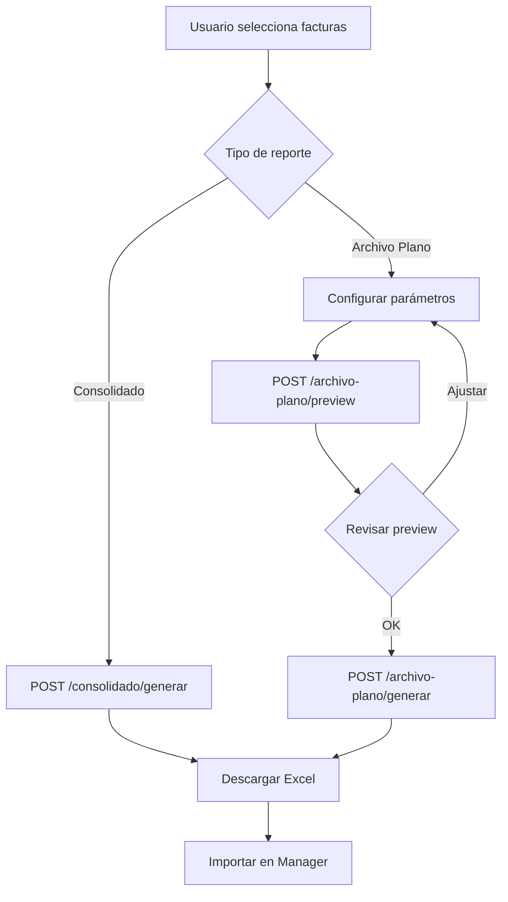

# Generación de Reportes y Archivos

## 📋 Descripción General

El sistema genera múltiples tipos de reportes y archivos para facilitar la gestión contable y el análisis de facturas. Los principales formatos son consolidados Excel y archivos planos para importación en Manager ERP.

## 📊 Tipos de Reportes

### 1. Consolidado de Facturas (Excel)

**Endpoint:** `POST /api/consolidado/generar`

**Propósito:** Generar un archivo Excel consolidado con todas las facturas seleccionadas, usando una plantilla predefinida.

**Características:**
- Usa plantilla corporativa con logo
- Múltiples hojas de cálculo
- Formato profesional predefinido
- Nombre de archivo con fecha automática

**Request:**
```json
{
  "factura_ids": [1, 2, 3, 4, 5]
}
```

**Estructura del archivo generado:**

#### Hoja "info" (Datos)
| Columna | Campo | Descripción |
|---------|-------|-------------|
| A | Fecha Factura | Fecha de emisión |
| F | Número Factura | Número de la factura |
| L | Proveedor + Oficinas | Nombre proveedor y oficinas asignadas |
| U | Valor | Monto total |
| Z | Fecha Recibido | Fecha de registro en sistema |

#### Hoja "F-GFI-2" (Presentación)
- Contiene el formato visual con logo
- Referencias a la hoja "info" para mostrar datos
- Formato corporativo de La Fortuna

**Nombre del archivo:**
```
{DIA}-{MES}-{AÑO}-FO-GFI-02RelaciondeFacturasEntregadasV.2.xlsx
Ejemplo: 20-ENE-2026-FO-GFI-02RelaciondeFacturasEntregadasV.2.xlsx
```

**Código de ejemplo:**
```python
# Generar consolidado
facturas_seleccionadas = [1, 2, 3]
response = requests.post(
    "http://localhost:8000/api/consolidado/generar",
    json={"factura_ids": facturas_seleccionadas},
    headers={"X-API-Key": "your-api-key"}
)

# Guardar archivo
with open("consolidado.xlsx", "wb") as f:
    f.write(response.content)
```

### 2. Archivo Plano para Manager (Excel)

**Endpoint:** `POST /api/archivo-plano/generar`

**Propósito:** Generar archivo Excel con formato específico para importación en Manager ERP.

**Características:**
- 43 columnas con formato específico
- Cálculos automáticos de IVA y retención
- Distribución 70%/30% por centro de costo
- Consecutivos automáticos
- Integración con Oracle para centros de costo

**Request:**
```json
{
  "proveedor_nit": "890123456",
  "proveedor_nombre": "CLARO COLOMBIA S.A.",
  "fecha_causacion": "2026-01-20",
  "tiene_iva": true,
  "porcentaje_retefuente": 4,
  "numedoc": 1290,
  "facturas": [
    {
      "numero_factura": "FAC-2026-001",
      "fecha_factura": "2026-01-15",
      "oficinas": [
        {
          "cod_oficina": "OF-001",
          "valor": 1190000.00,
          "nombre_oficina": "Oficina Bogotá"
        }
      ]
    }
  ]
}
```

**Estructura del archivo:**

#### Columnas Principales

| Columna | Nombre | Tipo | Descripción |
|---------|--------|------|-------------|
| A | EMPRESA | C3 | Código empresa (101) |
| B | CLASE | C4 | Clase documento (0000) |
| D | TIPODOC | C4 | Tipo documento (DC07) |
| E | NUMEDOC | N12 | Número consecutivo |
| F | REG | N12 | Registro (0) |
| G | FECHA | C10 | Fecha causación |
| H | CUENTA | C14 | Cuenta contable |
| I | VINCULADO | C15 | NIT proveedor |
| L | CCOSTO | C10 | Centro de costo |
| M | DESTINO | C10 | Código oficina |
| AG | VALDEBI | N20 | Valor débito |
| AH | VALCRED | N20 | Valor crédito |
| AK | DETALLE | C250 | Descripción |

#### Cuentas Contables Utilizadas

| Cuenta | Descripción | Tipo | Porcentaje |
|--------|-------------|------|------------|
| 61350513 | Gastos Internet | DÉBITO | 70% del valor base |
| 61700360 | Gastos Comunicaciones | DÉBITO | 30% del valor base |
| 24081003 | IVA por Pagar | DÉBITO | 19% (si aplica) |
| 23652501 | Retención en la Fuente | CRÉDITO | 4% o 6% del valor base |
| 23355002 | Cuentas por Pagar | CRÉDITO | Balance total |

#### Lógica de Cálculo

```python
# Para cada oficina:
valor_total = 1190000.00  # Valor con IVA

# Si tiene IVA:
valor_base = valor_total / 1.19  # = 1000000.00
valor_iva = valor_total - valor_base  # = 190000.00

# Distribución 70%/30%:
valor_70 = valor_base * 0.70  # = 700000.00 (Cuenta 61350513)
valor_30 = valor_base * 0.30  # = 300000.00 (Cuenta 61700360)

# Retención (sobre valor base):
retefuente = valor_base * 0.04  # = 40000.00 (si es 4%)

# Balance a pagar:
total_debitos = valor_70 + valor_30 + valor_iva  # = 1190000.00
total_creditos = retefuente  # = 40000.00
balance = total_debitos - total_creditos  # = 1150000.00 (Cuenta 23355002)
```

#### Ejemplo de Filas Generadas

Para una factura de $1,190,000 con IVA y retención 4%:

| Fila | Cuenta | CCOSTO | DESTINO | VALDEBI | VALCRED | DETALLE |
|------|--------|--------|---------|---------|---------|---------|
| 1 | 61350513 | CC-100 | OF-001 | 700000 | 0 | FACT FAC-001 SERVICIO DE INTERNET Bogotá MES ENERO |
| 2 | 61700360 | CC-100 | OF-001 | 300000 | 0 | FACT FAC-001 SERVICIO DE INTERNET Bogotá MES ENERO |
| 3 | 24081003 | CC-100 | . | 190000 | 0 | FACT FAC-001 SERVICIO DE INTERNET Bogotá MES ENERO |
| 4 | 23652501 | CC-100 | OF-001 | 0 | 40000 | FACT FAC-001 SERVICIO DE INTERNET Bogotá MES ENERO |
| 5 | 23355002 | CC-100 | OF-001 | 0 | 1150000 | FACT FAC-001 SERVICIO DE INTERNET Bogotá MES ENERO |

**Nombre del archivo:**
```
archivo_plano_{NIT}_{FECHA}.xlsx
Ejemplo: archivo_plano_890123456_20260120.xlsx
```

### 3. Preview de Causación

**Endpoint:** `POST /api/causacion-manager/preview`

**Propósito:** Previsualizar los datos que se generarían sin crear el archivo.

**Response:**
```json
{
  "success": true,
  "proveedor_nit": "890123456",
  "proveedor_nombre": "CLARO COLOMBIA S.A.",
  "fecha_causacion": "2026/01/20",
  "tiene_iva": true,
  "porcentaje_retefuente": 4,
  "facturas": [
    {
      "numero_factura": "FAC-2026-001",
      "numedoc": 1290,
      "rows": [
        {
          "row_num": 1,
          "cuenta": "61350513",
          "tipo_movimiento": "DEBITO",
          "ccosto": "CC-100",
          "destino": "OF-001",
          "valor": 700000,
          "detalle": "FACT FAC-2026-001 SERVICIO DE INTERNET Bogotá MES ENERO"
        }
      ],
      "total_debitos": 1190000,
      "total_creditos": 1190000
    }
  ],
  "total_facturas": 1,
  "total_debitos": 1190000,
  "total_creditos": 1190000,
  "balance": 0,
  "numedoc_inicial": 1290,
  "numedoc_final": 1290
}
```

### 4. Reportes del Dashboard

**Endpoint:** `GET /api/reportes/dashboard`

**Propósito:** Obtener métricas y estadísticas para el dashboard.

**Response:**
```json
{
  "resumen_anual": {
    "anio": 2026,
    "total_facturado": 50000000,
    "total_pagado": 35000000,
    "total_pendiente": 15000000,
    "cantidad_facturas": 150
  },
  "por_mes": [
    {
      "mes": 1,
      "mes_nombre": "Enero",
      "total_facturado": 5000000,
      "total_pagado": 3500000,
      "cantidad_facturas": 15
    }
  ],
  "por_proveedor": [
    {
      "proveedor_id": 1,
      "proveedor_nombre": "CLARO COLOMBIA",
      "total_facturado": 10000000,
      "cantidad_facturas": 30
    }
  ],
  "por_estado": {
    "PENDIENTE": 20,
    "ASIGNADA": 80,
    "PAGADA": 50
  }
}
```

## 🔧 Configuración de Plantillas

### Ubicación de Plantillas

```
backend/
├── Template_consolidado/
│   ├── template_relacion_facturas.xlsx
│   └── la fortuna.jpg
└── Template_archivo_plano/
    └── template_plano.xlsx
```

### Modificar Plantillas

**Para el consolidado:**
1. Abrir `template_relacion_facturas.xlsx`
2. Modificar formato en hoja "F-GFI-2"
3. Mantener hoja "info" con estructura de columnas
4. Guardar sin cambiar nombres de hojas

**Para archivo plano:**
1. Abrir `template_plano.xlsx`
2. Fila 1 debe contener headers (43 columnas)
3. Todas las celdas deben tener formato "Texto"
4. No modificar número de columnas

## 📈 Uso desde el Frontend

### Generar Consolidado

```typescript
// En el frontend
async function generarConsolidado(facturaIds: number[]) {
  const response = await fetch('/api/consolidado/generar', {
    method: 'POST',
    headers: {
      'Content-Type': 'application/json',
      'X-API-Key': API_KEY
    },
    body: JSON.stringify({ factura_ids: facturaIds })
  });
  
  const blob = await response.blob();
  const url = window.URL.createObjectURL(blob);
  const a = document.createElement('a');
  a.href = url;
  a.download = 'consolidado.xlsx';
  a.click();
}
```

### Generar Archivo Plano

```typescript
async function generarArchivoPlano(data: ArchivoPlanoRequest) {
  const response = await fetch('/api/archivo-plano/generar', {
    method: 'POST',
    headers: {
      'Content-Type': 'application/json',
      'X-API-Key': API_KEY
    },
    body: JSON.stringify(data)
  });
  
  const blob = await response.blob();
  const url = window.URL.createObjectURL(blob);
  const a = document.createElement('a');
  a.href = url;
  a.download = `archivo_plano_${data.proveedor_nit}.xlsx`;
  a.click();
}
```

## ⚠️ Consideraciones Importantes

### Rendimiento
- Consolidados: < 3 segundos para hasta 1000 facturas
- Archivo plano: < 5 segundos para hasta 100 facturas
- Preview: < 2 segundos

### Límites
- Consolidado: Máximo 5000 facturas por archivo
- Archivo plano: Máximo 500 facturas por archivo
- Si se excede, dividir en múltiples archivos

### Validaciones
- Todas las facturas deben tener oficinas asignadas
- Valores deben ser numéricos positivos
- Fechas deben ser válidas
- NITs deben existir en la base de datos

### Errores Comunes

| Error | Causa | Solución |
|-------|-------|----------|
| Template not found | Plantilla no existe | Verificar ruta de plantillas |
| Invalid factura_ids | IDs no existen | Validar que facturas existan |
| Centro costo not found | Oficina no en Oracle | Verificar código de oficina |
| Balance mismatch | Error en cálculos | Revisar lógica de distribución |

## 🔄 Flujo Completo



---

**Próximo:** [Guías de Usuario](../06_Guias_Usuario/README.md)
