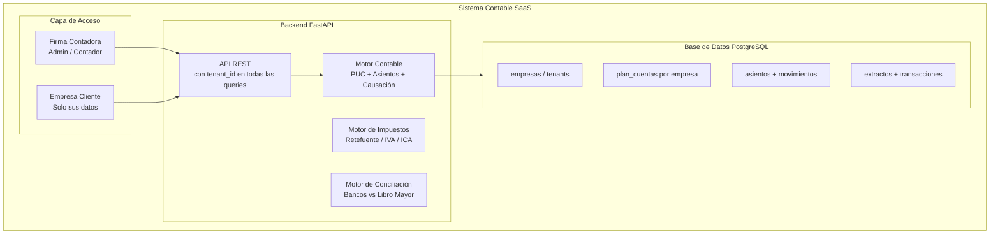

# Plan de Implementación: SaaS Contable Multi-Tenant para Firmas Colombianas

## Contexto y Decisiones Confirmadas

| Pregunta | Decisión |
|---|---|
| **Módulo prioritario** | Contabilidad general — PUC colombiano |
| **Relación con sistema existente** | Sistema **nuevo e independiente** — no se modifica nada del sistema actual sin confirmación previa |
| **Tipo de usuario** | Contadores / firmas que manejan **múltiples clientes** |
| **Multi-tenant** | ✅ **Obligatorio desde el día 1** |
| **Base de datos** | **PostgreSQL directamente** (nuevo schema `contabilidad`, sin tocar el DB existente) |
| **Bancos soportados** | **Bancolombia** y **Davivienda** (parsers CSV/Excel prioritarios) |
| **Régimen tributario** | **Régimen Ordinario** — IVA completo, Retefuente, ReteIVA, ICA, Medios Magnéticos DIAN |

---

## Arquitectura General



---

## Modelo de Datos Multi-Tenant

> [!IMPORTANT]
> Cada tabla contable lleva `empresa_id` como llave foránea discriminadora. Una firma puede crear N empresas-cliente. Un usuario puede tener acceso a múltiples empresas con distintos roles.

### Entidades nuevas (capa de identidad):

**`Empresa`** — el "tenant" (cada empresa que maneja la firma)
```
id, nit, razon_social, regimen, responsable_iva, municipio,
direccion, telefono, representante_legal, activa, firma_id
```

**`Firma`** (el dueño del SaaS — la firma contadora)
```
id, nombre, nit, plan_suscripcion, activa
```

**`Usuario`** — con roles por empresa
```
id, email, nombre, hashed_password, firma_id
```

**`UsuarioEmpresa`** — acceso multi-empresa
```
usuario_id, empresa_id, rol (ADMIN | CONTADOR | AUDITOR | SOLO_LECTURA)
```

---

## Fases de Desarrollo

### ✅ Fase 0 — Ya Hecho (en [models_contabilidad.py](file:///c:/Users/alejandro.carvajal/Documents/langextract_ocr/backend/models_contabilidad.py))
- Modelos base: [CuentaContable](file:///c:/Users/alejandro.carvajal/Documents/langextract_ocr/backend/models_contabilidad.py#5-35), [AsientoContable](file:///c:/Users/alejandro.carvajal/Documents/langextract_ocr/backend/models_contabilidad.py#37-61), [MovimientoContable](file:///c:/Users/alejandro.carvajal/Documents/langextract_ocr/backend/models_contabilidad.py#63-91)
- Módulos bancarios: [CuentaBancaria](file:///c:/Users/alejandro.carvajal/Documents/langextract_ocr/backend/models_contabilidad.py#93-108), [ExtractoBancario](file:///c:/Users/alejandro.carvajal/Documents/langextract_ocr/backend/models_contabilidad.py#110-129), [TransaccionBancaria](file:///c:/Users/alejandro.carvajal/Documents/langextract_ocr/backend/models_contabilidad.py#131-155)
- Motor de reglas: [ReglaConciliacion](file:///c:/Users/alejandro.carvajal/Documents/langextract_ocr/backend/models_contabilidad.py#157-177)
- Script PUC básico: [populate_puc.py](file:///c:/Users/alejandro.carvajal/Documents/langextract_ocr/backend/populate_puc.py)

---

### 🔴 Fase 1 — Fundación Multi-Tenant + PUC Completo
**Prioridad: Alta — Todo depende de esta fase**

#### [NEW] `models_empresa.py`
- `Firma`, `Empresa`, `Usuario`, `UsuarioEmpresa`
- Añadir `empresa_id` a [CuentaContable](file:///c:/Users/alejandro.carvajal/Documents/langextract_ocr/backend/models_contabilidad.py#5-35), [AsientoContable](file:///c:/Users/alejandro.carvajal/Documents/langextract_ocr/backend/models_contabilidad.py#37-61), [CuentaBancaria](file:///c:/Users/alejandro.carvajal/Documents/langextract_ocr/backend/models_contabilidad.py#93-108)

#### [NEW] `routers/auth.py`
- `POST /auth/registro` — Registro de firma y primer usuario admin
- `POST /auth/login` — JWT con claims: `{user_id, empresa_id, rol}`
- `GET /auth/empresas` — Empresas a las que tiene acceso el usuario
- `POST /auth/switch-empresa` — Cambiar empresa activa en sesión

#### [NEW] `routers/empresas.py`
- CRUD de empresas-cliente dentro de la firma

#### [MODIFY] [populate_puc.py](file:///c:/Users/alejandro.carvajal/Documents/langextract_ocr/backend/populate_puc.py)
- Expandir al **PUC Decreto 2649 completo** (~400 cuentas clave)
- Función `clonar_puc(empresa_id)` — al crear empresa, clonar el PUC base para esa empresa

#### [MODIFY] `routers/contabilidad.py`
- Todos los endpoints filtran por `empresa_id` del JWT
- `POST /contabilidad/asientos` — Validación `Sum(DB) == Sum(CR)`
- `GET /contabilidad/libro-mayor/{cuenta_id}`
- `GET /contabilidad/balance-comprobacion`

---

### 🟠 Fase 2 — Motor Contable Core
**Prioridad: Alta**

#### [NEW] `services/causacion.py`
- Plantillas de asientos por tipo de operación:
  - **Causación de factura de compra**: DB Gasto / CR Proveedor (+ retenciones)
  - **Pago a proveedor**: DB Proveedor / CR Banco
  - **Causación de venta**: DB Cliente / CR Ingreso (+ IVA)
  - **Nota crédito**: Reverso del asiento de venta/compra
- Cálculo automático de `retefuente`, `reteiva`, `ica` según tarifa configurada

#### [NEW] `services/impuestos.py`
- Tarifas de retención configurables por empresa y tipo de concepto
- `calcular_retenciones(empresa_id, monto_base, tipo_concepto)` → dict

#### [NEW] `routers/periodos.py`
- `POST /periodos` — Crear período contable (mes/año)
- `POST /periodos/{id}/cerrar` — Bloquear movimientos, calcular saldos de cierre
- `POST /periodos/{id}/abrir-siguiente` — Asiento de apertura automático

---

### 🟡 Fase 3 — Extractos Bancarios y Conciliación
**Prioridad: Media**

#### [NEW] `routers/bancario.py`
- `POST /bancario/extractos/upload` — Parsear CSV/Excel (Bancolombia, Davivienda, BBVA)
- `POST /conciliacion/analizar/{extracto_id}` — Motor de scoring
- `POST /conciliacion/aprobar` — Aprobar sugerencia → crea movimiento conciliado

#### [MODIFY] [models_contabilidad.py](file:///c:/Users/alejandro.carvajal/Documents/langextract_ocr/backend/models_contabilidad.py)
- `hash_transaccion` en [TransaccionBancaria](file:///c:/Users/alejandro.carvajal/Documents/langextract_ocr/backend/models_contabilidad.py#131-155) (previene duplicados por hash Monto+Fecha+Ref)
- `parser_formato` en [ExtractoBancario](file:///c:/Users/alejandro.carvajal/Documents/langextract_ocr/backend/models_contabilidad.py#110-129)

**Algoritmo de scoring:**
| Condición | Puntos |
|---|---|
| Monto exactamente igual | +50 |
| Diferencia de fecha ≤ 3 días | +30 |
| Keyword en referencia (NIT, nombre) | +20 |
| Score ≥ 70 → `SUGERIDO`, Score = 100 → `CONCILIADO` automático | — |

---

### 🟢 Fase 4 — Reportes + Cumplimiento DIAN
**Prioridad: Media-Alta (exigido por contadores)**

#### [NEW] `routers/reportes.py`
- `GET /reportes/balance-general?fecha=` — Activos = Pasivos + Patrimonio
- `GET /reportes/estado-resultados?desde=&hasta=` — P&L completo
- `GET /reportes/retenciones?periodo=` — Por proveedor, por concepto
- `GET /reportes/medios-magneticos?anio=` — Formato 1001 DIAN (CSV/TXT)

---

### 🔵 Fase 5 — Frontend SaaS
**Prioridad: Media (paralelo a Fase 3-4)**

#### Nuevo proyecto `frontend-contable/` (React + Vite)
| Pantalla | Descripción |
|---|---|
| Login / Switch Empresa | Selección de empresa activa post-login |
| Dashboard | KPIs: Activos, Pasivos, Patrimonio, Utilidad del mes |
| Plan de Cuentas | Árbol PUC con saldos por cuenta |
| Asientos Contables | CRUD con validación DB=CR en tiempo real |
| Libro Mayor | Movimientos por cuenta con saldo progresivo |
| Conciliación | UI Match/Split estilo Tinder |
| Reportes | Balance General, P&L, Flujo de Caja (PDF + Excel) |
| Medios Magnéticos | Generación y descarga Formato 1001 DIAN |

---

## Stack Tecnológico

| Capa | Tecnología |
|---|---|
| Backend | Python 3.11 + FastAPI + SQLAlchemy 2.0 |
| Auth | JWT (`python-jose`) + bcrypt |
| Base de Datos | **PostgreSQL** (multi-tenant requiere FK robustas) |
| Frontend | React 18 + Vite + TanStack Query |
| Parseo Extractos | `pandas` + `openpyxl` |
| Reportes PDF | `reportlab` o `weasyprint` |
| Exportación Excel | `openpyxl` |
| Despliegue | Docker Compose (backend + PostgreSQL + frontend) |

> [!IMPORTANT]
> El nuevo sistema usará **PostgreSQL en un schema separado** (`contabilidad`). El sistema existente (SQLite + facturas/proveedores) **no se toca**. La integración con n8n será opcional vía API REST en el futuro.

### Régimen Ordinario — Obligaciones Fiscales Incluidas
| Obligación | Detalle |
|---|---|
| **IVA** | 19% estándar, tarificación por tipo de bien/servicio |
| **Retefuente** | Tarifas por concepto (compras 2.5-3.5%, servicios 4-6%, honorarios 10-11%) |
| **ReteIVA** | 15% del IVA — aplica cuando comprador es Gran Contribuyente |
| **ICA** | Tarifa por municipio (Bogotá, Medellín, Cali, etc.) |
| **Medios Magnéticos** | Formatos 1001, 1007, 1008 DIAN anuales |

---

## ✅ Todas las decisiones arquitecturales confirmadas — Listo para Fase 1

---

## Plan de Verificación

### Automático
- Asiento con `Sum(DB) ≠ Sum(CR)` → `HTTP 400`  
- Dos usuarios de empresas distintas no ven datos cruzados (test de aislamiento multi-tenant)
- Subir mismo extracto dos veces → sin duplicados

### Manual
- Crear empresa → clonar PUC → crear asiento de apertura → ver balance
- Aprobar factura → verificar asiento de causación generado automáticamente
- Generar Balance General y validar `Activos = Pasivos + Patrimonio`
