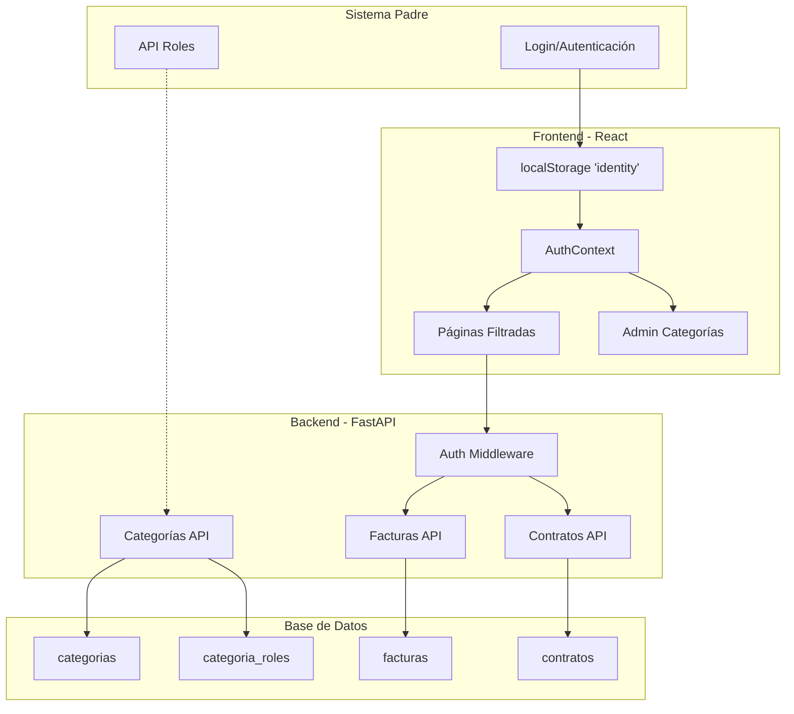
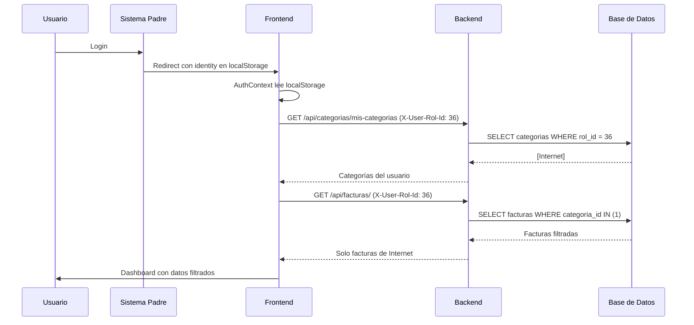

# Sistema de Categorías de Facturas por Rol

## Descripción
Implementar un sistema de control de acceso donde las facturas se organizan por **categorías** (ej: Internet, Servicios Públicos) y cada categoría puede ser accedida por uno o varios **roles**. El usuario llega desde un sistema externo con su información almacenada en `localStorage` bajo la key `identity`.

## User Review Required

> [!IMPORTANT]
> **Roles del Sistema Padre**: Los roles se consultarán desde un endpoint externo configurable en `.env`. Por favor confirma que este endpoint devuelve una lista de roles disponibles.

> [!IMPORTANT]
> **Super Admin**: Se identificará por el nombre del rol. ¿El rol de super admin se llama "Super Admin", "Administrador" o tiene otro nombre específico?

---

## Arquitectura Propuesta



---

## Proposed Changes

### Base de Datos

#### [NEW] [add_categorias_tables.sql](file:///c:/Users/alejandro.carvajal/Documents/langextract_ocr/backend/migrations/add_categorias_tables.sql)

Nuevas tablas para el sistema de categorías:

```sql
-- Tabla de categorías de facturas
CREATE TABLE IF NOT EXISTS categorias (
    id SERIAL PRIMARY KEY,
    nombre VARCHAR(100) NOT NULL UNIQUE,
    descripcion TEXT,
    color VARCHAR(7) DEFAULT '#6366f1',  -- Color para UI
    activa BOOLEAN DEFAULT true,
    created_at TIMESTAMP DEFAULT CURRENT_TIMESTAMP,
    created_by VARCHAR(100)
);

-- Relación muchos a muchos: categorías - roles
CREATE TABLE IF NOT EXISTS categoria_roles (
    id SERIAL PRIMARY KEY,
    categoria_id INTEGER NOT NULL REFERENCES categorias(id) ON DELETE CASCADE,
    rol_id INTEGER NOT NULL,           -- ID del rol en sistema padre
    rol_nombre VARCHAR(100) NOT NULL,  -- Nombre del rol (cache)
    created_at TIMESTAMP DEFAULT CURRENT_TIMESTAMP,
    UNIQUE(categoria_id, rol_id)
);

-- Agregar columna categoria_id a facturas
ALTER TABLE facturas ADD COLUMN IF NOT EXISTS categoria_id INTEGER REFERENCES categorias(id);

-- Agregar columna categoria_id a contratos
ALTER TABLE contratos ADD COLUMN IF NOT EXISTS categoria_id INTEGER REFERENCES categorias(id);

-- Índices para búsquedas rápidas
CREATE INDEX IF NOT EXISTS idx_facturas_categoria ON facturas(categoria_id);
CREATE INDEX IF NOT EXISTS idx_contratos_categoria ON contratos(categoria_id);
CREATE INDEX IF NOT EXISTS idx_categoria_roles_rol ON categoria_roles(rol_id);
```

---

### Backend - Modelos

#### [MODIFY] [models.py](file:///c:/Users/alejandro.carvajal/Documents/langextract_ocr/backend/models.py)

Agregar nuevos modelos:

```python
class Categoria(Base):
    """Categorías de facturas (Internet, Servicios Públicos, etc.)"""
    __tablename__ = "categorias"
    
    id = Column(Integer, primary_key=True, index=True)
    nombre = Column(String(100), unique=True, nullable=False)
    descripcion = Column(Text)
    color = Column(String(7), default='#6366f1')
    activa = Column(Boolean, default=True)
    created_at = Column(DateTime, server_default=func.now())
    created_by = Column(String(100))
    
    # Relationships
    roles = relationship("CategoriaRol", back_populates="categoria", cascade="all, delete-orphan")
    facturas = relationship("Factura", back_populates="categoria")
    contratos = relationship("Contrato", back_populates="categoria")


class CategoriaRol(Base):
    """Relación categoría - rol del sistema padre"""
    __tablename__ = "categoria_roles"
    
    id = Column(Integer, primary_key=True, index=True)
    categoria_id = Column(Integer, ForeignKey("categorias.id", ondelete="CASCADE"), nullable=False)
    rol_id = Column(Integer, nullable=False)
    rol_nombre = Column(String(100), nullable=False)
    created_at = Column(DateTime, server_default=func.now())
    
    # Relationships
    categoria = relationship("Categoria", back_populates="roles")
```

Modificar modelos existentes para agregar relación con categoría:

```diff
# En clase Factura, agregar:
+    categoria_id = Column(Integer, ForeignKey("categorias.id"), nullable=True)
+    categoria = relationship("Categoria", back_populates="facturas")

# En clase Contrato, agregar:
+    categoria_id = Column(Integer, ForeignKey("categorias.id"), nullable=True)
+    categoria = relationship("Categoria", back_populates="contratos")
```

---

### Backend - Configuración

#### [MODIFY] [.env](file:///c:/Users/alejandro.carvajal/Documents/langextract_ocr/backend/.env)

Agregar configuración para el endpoint de roles:

```diff
+# Sistema Padre - Endpoint para consultar roles disponibles
+PARENT_SYSTEM_ROLES_URL=https://saman.lafortuna.com.co/api/roles
+PARENT_SYSTEM_API_TOKEN=your-api-token-here
+
+# Nombre del rol de Super Admin (puede ver todas las categorías)
+SUPER_ADMIN_ROL_NAME=Super Admin
```

---

### Backend - Router de Categorías

#### [NEW] [categorias.py](file:///c:/Users/alejandro.carvajal/Documents/langextract_ocr/backend/routers/categorias.py)

Nuevo router para gestión de categorías:

| Endpoint | Método | Descripción | Acceso |
|----------|--------|-------------|--------|
| `/api/categorias/` | GET | Listar categorías (filtradas por rol del usuario) | Todos |
| `/api/categorias/` | POST | Crear categoría | Super Admin |
| `/api/categorias/{id}` | PUT | Actualizar categoría | Super Admin |
| `/api/categorias/{id}` | DELETE | Eliminar categoría | Super Admin |
| `/api/categorias/{id}/roles` | GET | Ver roles asignados a categoría | Super Admin |
| `/api/categorias/{id}/roles` | POST | Asignar rol a categoría | Super Admin |
| `/api/categorias/{id}/roles/{rol_id}` | DELETE | Quitar rol de categoría | Super Admin |
| `/api/categorias/roles-disponibles` | GET | Consultar roles del sistema padre | Super Admin |
| `/api/categorias/mis-categorias` | GET | Categorías del rol actual | Todos |

---

### Backend - Modificar Routers Existentes

#### [MODIFY] [facturas.py](file:///c:/Users/alejandro.carvajal/Documents/langextract_ocr/backend/routers/facturas.py)

Cambios principales:
1. Agregar parámetro `categoria_id` a endpoint `list_facturas`
2. Agregar header `X-User-Rol-Id` para filtrar por rol del usuario
3. Si el usuario tiene un rol específico, solo mostrar facturas de sus categorías asignadas
4. Super Admin ve todas las facturas

```python
# Ejemplo de lógica de filtrado
async def get_user_categorias(rol_id: int, db: AsyncSession) -> List[int]:
    """Obtiene las categorías a las que tiene acceso un rol"""
    result = await db.execute(
        select(CategoriaRol.categoria_id)
        .where(CategoriaRol.rol_id == rol_id)
    )
    return [r[0] for r in result.fetchall()]
```

#### [MODIFY] [contracts.py](file:///c:/Users/alejandro.carvajal/Documents/langextract_ocr/backend/routers/contracts.py)

Cambios similares a facturas:
1. Agregar filtro por `categoria_id`
2. Filtrar contratos según categorías del rol del usuario

#### [MODIFY] [reportes.py](file:///c:/Users/alejandro.carvajal/Documents/langextract_ocr/backend/routers/reportes.py)

Cambios:
1. Filtrar estadísticas según categorías del rol
2. Dashboard solo muestra datos de categorías permitidas

---

### Frontend - Autenticación

#### [NEW] [AuthContext.tsx](file:///c:/Users/alejandro.carvajal/Documents/langextract_ocr/frontend/src/contexts/AuthContext.tsx)

Contexto de autenticación que lee del localStorage:

```typescript
interface Usuario {
  id: number;
  name: string;
  email: string;
  cedula: number;
  rol: {
    id: number;
    name: string;
  };
  zona: string;
}

interface AuthContextType {
  user: Usuario | null;
  rolId: number | null;
  rolName: string | null;
  isSuperAdmin: boolean;
  isLoading: boolean;
  categorias: Categoria[];
  logout: () => void;
}
```

#### [NEW] [useAuth.ts](file:///c:/Users/alejandro.carvajal/Documents/langextract_ocr/frontend/src/hooks/useAuth.ts)

Hook para acceso fácil al contexto de autenticación.

---

### Frontend - Modificaciones UI

#### [MODIFY] [App.tsx](file:///c:/Users/alejandro.carvajal/Documents/langextract_ocr/frontend/src/App.tsx)

Envolver la app con `AuthProvider`:

```diff
+import { AuthProvider } from './contexts/AuthContext';

function App() {
  return (
+   <AuthProvider>
      <BrowserRouter basename="/facturacion_ia">
        {/* ... resto del código ... */}
      </BrowserRouter>
+   </AuthProvider>
  );
}
```

#### [MODIFY] [Sidebar.tsx](file:///c:/Users/alejandro.carvajal/Documents/langextract_ocr/frontend/src/components/Sidebar.tsx)

Mostrar:
- Nombre del usuario y rol actual
- Opción "Administrar Categorías" solo para Super Admin
- Filtrar menú según permisos

#### [MODIFY] [DashboardHome.tsx](file:///c:/Users/alejandro.carvajal/Documents/langextract_ocr/frontend/src/pages/DashboardHome.tsx)

- Pasar `categoria_ids` como parámetro a las APIs
- Mostrar selector de categoría si el usuario tiene acceso a múltiples

#### [MODIFY] [FacturasPage.tsx](file:///c:/Users/alejandro.carvajal/Documents/langextract_ocr/frontend/src/pages/FacturasPage.tsx)

- Agregar filtro/selector de categoría
- Enviar headers de autenticación en requests
- Al crear/editar factura, permitir seleccionar categoría

#### [NEW] [CategoriasAdminPage.tsx](file:///c:/Users/alejandro.carvajal/Documents/langextract_ocr/frontend/src/pages/CategoriasAdminPage.tsx)

Página de administración para Super Admin:
- CRUD de categorías
- Asignación de roles a categorías
- Selector de roles desde sistema padre

---

## Verification Plan

### Automated Tests

```bash
# Probar endpoints de categorías
curl -X GET "http://localhost:8000/api/categorias/" -H "X-User-Rol-Id: 36"

# Probar filtrado de facturas por rol
curl -X GET "http://localhost:8000/api/facturas/" -H "X-User-Rol-Id: 36"

# Probar creación de categoría (solo super admin)
curl -X POST "http://localhost:8000/api/categorias/" \
  -H "X-User-Rol-Id: 1" \
  -H "Content-Type: application/json" \
  -d '{"nombre": "Internet", "descripcion": "Facturas de servicios de internet"}'
```

### Manual Verification

1. **Como usuario operativo (rol 36)**:
   - Verificar que solo ve facturas de sus categorías asignadas
   - Verificar que el dashboard muestra estadísticas filtradas
   - Verificar que no puede acceder a Administración de Categorías

2. **Como Super Admin**:
   - Puede ver todas las facturas de todas las categorías
   - Puede crear/editar/eliminar categorías
   - Puede asignar roles a categorías
   - Puede consultar roles del sistema padre

3. **Prueba de aislamiento**:
   - Crear dos categorías: "Internet" y "Servicios Públicos"
   - Asignar rol "Operativo Internet" a categoría "Internet"
   - Asignar rol "Operativo SP" a categoría "Servicios Públicos"
   - Verificar que cada rol solo ve sus facturas correspondientes

---

## Flujo de Usuario



---

## Resumen de Archivos

| Archivo | Acción | Descripción |
|---------|--------|-------------|
| `migrations/add_categorias_tables.sql` | NEW | Script SQL para crear tablas |
| `models.py` | MODIFY | Agregar modelos Categoria y CategoriaRol |
| `.env` | MODIFY | Agregar configuración de sistema padre |
| `routers/categorias.py` | NEW | CRUD de categorías |
| `routers/facturas.py` | MODIFY | Filtrar por categoría/rol |
| `routers/contracts.py` | MODIFY | Filtrar por categoría/rol |
| `routers/reportes.py` | MODIFY | Estadísticas filtradas |
| `contexts/AuthContext.tsx` | NEW | Contexto de autenticación |
| `hooks/useAuth.ts` | NEW | Hook de autenticación |
| `App.tsx` | MODIFY | Envolver con AuthProvider |
| `Sidebar.tsx` | MODIFY | Mostrar usuario y permisos |
| `DashboardHome.tsx` | MODIFY | Filtrar estadísticas |
| `FacturasPage.tsx` | MODIFY | Filtrar facturas |
| `pages/CategoriasAdminPage.tsx` | NEW | Administración de categorías |
